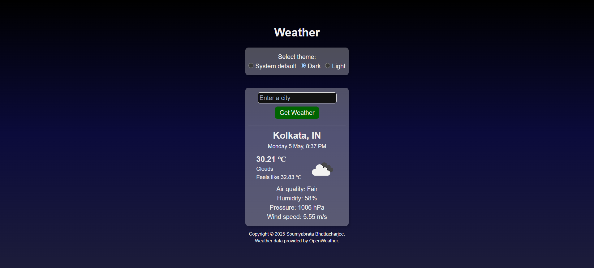

# Weather

A simple tool fetching basic weather information from OpenWeather's API. Enter a city, press "Get Weather" and you will get the basic weather information of the city, including temperature, air quality, humidity, pressure and wind speed.

